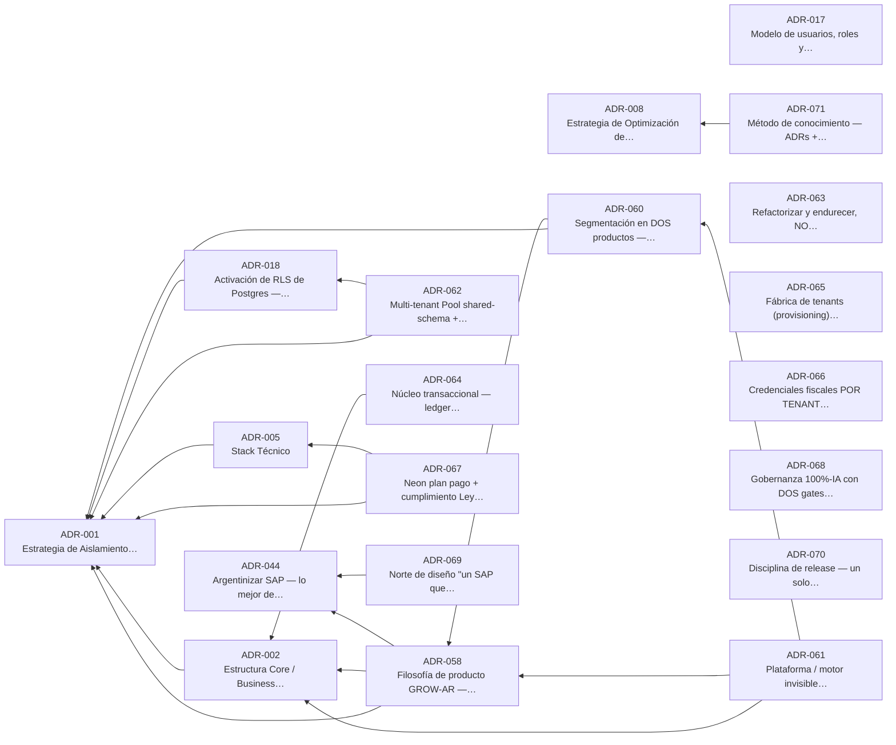

<!-- GENERADO por scripts/brain-sync.mjs — NO editar a mano -->

# 🏛️ Decisiones — índice fino

> 87 decisiones. Esto es el **mapa** (1 línea por ADR); el razonamiento completo vive
> en `docs/adr/ADR-NNN-*.md` y **no se resume** (ADR-008: el *porqué* es lo que evita rediscutir).
> Para armar una lista de lectura acotada por tema: `npm run adr:context -- <keywords>`.

## 🏛️ Fundacionales (20) — lo no negociable

- **[ADR-001](ADR-001.md)** 🏛️ — Estrategia de Aislamiento Multi-Tenant _(19 dependientes)_ · [fuente ADR-001](../../docs/adr/ADR-001-multi-tenant-strategy.md)
- **[ADR-002](ADR-002.md)** 🏛️ — Estructura Core / Business Capabilities / Blueprints / Plugins _(20 dependientes)_ · [fuente ADR-002](../../docs/adr/ADR-002-core-blueprints-plugins.md)
- **[ADR-005](ADR-005.md)** 🏛️ — Stack Técnico _(7 dependientes)_ · [fuente ADR-005](../../docs/adr/ADR-005-stack-tecnico.md)
- **[ADR-008](ADR-008.md)** 🏛️ — Estrategia de Optimización de Costo de Tokens (Claude) Durante el Desarrollo _(8 dependientes)_ · [fuente ADR-008](../../docs/adr/ADR-008-optimizacion-tokens-claude.md)
- **[ADR-017](ADR-017.md)** 🏛️ — Modelo de usuarios, roles y autorización (RBAC) para el piloto _(3 dependientes)_ · [fuente ADR-017](../../docs/adr/ADR-017-usuarios-roles-rbac.md)
- **[ADR-018](ADR-018.md)** 🏛️ — Activación de RLS de Postgres — mecanismo y momento (gate del 2º tenant) _(10 dependientes)_ · [fuente ADR-018](../../docs/adr/ADR-018-activacion-rls-postgres.md)
- **[ADR-044](ADR-044.md)** 🏛️ — Argentinizar SAP — lo mejor de SAP, adaptado a la realidad de la pyme argentina (principio transversal de auditoría) _(6 dependientes)_ · [fuente ADR-044](../../docs/adr/ADR-044-argentinizar-sap.md)
- **[ADR-058](ADR-058.md)** 🏛️ — Filosofía de producto GROW-AR — un Core, dos motores, crecé sin migrar _(6 dependientes)_ · [fuente ADR-058](../../docs/adr/ADR-058-filosofia-grow-ar-crece-sin-migrar.md)
- **[ADR-060](ADR-060.md)** 🏛️ — Segmentación en DOS productos — "Comercio Micro" y "PyME/Empresa" — con bases de datos separadas _(2 dependientes)_ · [fuente ADR-060](../../docs/adr/ADR-060-segmentacion-dos-productos-bases-separadas.md)
- **[ADR-061](ADR-061.md)** 🏛️ — Plataforma / motor invisible compartido entre productos (config-sobre-código) _(1 dependientes)_ · [fuente ADR-061](../../docs/adr/ADR-061-plataforma-motor-invisible-compartido.md)
- **[ADR-062](ADR-062.md)** 🏛️ — Multi-tenant Pool shared-schema + RLS como línea base NO negociable (+ realidad y gaps) · [fuente ADR-062](../../docs/adr/ADR-062-rls-pool-shared-schema-linea-base.md)
- **[ADR-063](ADR-063.md)** 🏛️ — Refactorizar y endurecer, NO reconstruir de cero (decidido con evidencia del ground-truth) · [fuente ADR-063](../../docs/adr/ADR-063-refactorizar-endurecer-no-reconstruir.md)
- **[ADR-064](ADR-064.md)** 🏛️ — Núcleo transaccional — ledger append-only + calculadoras puras en Decimal + invariantes I1–I7 · [fuente ADR-064](../../docs/adr/ADR-064-nucleo-transaccional-ledger-invariantes.md)
- **[ADR-065](ADR-065.md)** 🏛️ — Fábrica de tenants (provisioning) + fábrica de módulos (método repetible) · [fuente ADR-065](../../docs/adr/ADR-065-fabrica-de-tenants-y-fabrica-de-modulos.md)
- **[ADR-066](ADR-066.md)** 🏛️ — Credenciales fiscales POR TENANT (CUIT + certificado ARCA) — corrige "secreto por ámbito, no por cliente" _(1 dependientes)_ · [fuente ADR-066](../../docs/adr/ADR-066-credenciales-fiscales-por-tenant.md)
- **[ADR-067](ADR-067.md)** 🏛️ — Neon plan pago + cumplimiento Ley 25.326 + DR con RPO/RTO y PITR · [fuente ADR-067](../../docs/adr/ADR-067-neon-plan-pago-cumplimiento-y-dr.md)
- **[ADR-068](ADR-068.md)** 🏛️ — Gobernanza 100%-IA con DOS gates humanos — consultor funcional y ciberseguridad (fundadores) · [fuente ADR-068](../../docs/adr/ADR-068-gobernanza-100-ia-dos-gates-humanos.md)
- **[ADR-069](ADR-069.md)** 🏛️ — Norte de diseño "un SAP que diseñó Apple" — Apple×SAP y la arquitectura UX/UI como pilar _(2 dependientes)_ · [fuente ADR-069](../../docs/adr/ADR-069-norte-diseno-apple-por-sap-ux-pilar.md)
- **[ADR-070](ADR-070.md)** 🏛️ — Disciplina de release — un solo deploy para todos los tenants, pipeline preview→prod con gates, fix del mapeo rama→entorno · [fuente ADR-070](../../docs/adr/ADR-070-disciplina-de-release-un-deploy-para-todos.md)
- **[ADR-071](ADR-071.md)** 🏛️ — Método de conocimiento — ADRs + GEP como memoria organizacional ("nada listo sin artefacto + evidencia") · [fuente ADR-071](../../docs/adr/ADR-071-metodo-de-conocimiento-adrs-y-gep.md)

### El núcleo, dibujado

_La flecha se lee **"depende de"**. Solo el núcleo fundacional; el grafo completo (87 nodos) se navega en Obsidian, filtrando por tag._

**El mismo grafo, en texto:** cada nodo de arriba tiene su nota con las secciones *"Depende de"* y *"Lo que se cae si esto cambia"* — la misma información que las flechas, en listas de enlaces. Si no podés ver el diagrama, no te estás perdiendo nada.

## Vistas por dominio

_Solo los IDs: buscá el detalle en la lista completa de abajo (no se repite el título)._

- **Producto** (25) — ADR-003, ADR-004, ADR-009, ADR-011, ADR-012, ADR-013, ADR-014, ADR-022, ADR-024, ADR-025, ADR-027, ADR-030, ADR-031, ADR-034, ADR-035, ADR-036, ADR-037, ADR-044, ADR-056, ADR-058, ADR-059, ADR-060, ADR-061, ADR-066, ADR-069
- **Operaciones** (20) — ADR-016, ADR-026, ADR-032, ADR-033, ADR-038, ADR-039, ADR-040, ADR-045, ADR-046, ADR-047, ADR-048, ADR-049, ADR-050, ADR-051, ADR-052, ADR-053, ADR-063, ADR-068, ADR-070, ADR-071
- **Arquitectura** (16) — ADR-001, ADR-002, ADR-005, ADR-006, ADR-010, ADR-020, ADR-022, ADR-054, ADR-055, ADR-057, ADR-058, ADR-060, ADR-061, ADR-063, ADR-064, ADR-065
- **Plataforma** (11) — ADR-010, ADR-015, ADR-019, ADR-021, ADR-023, ADR-028, ADR-029, ADR-056, ADR-065, ADR-067, ADR-070
- **Seguridad** (10) — ADR-015, ADR-017, ADR-018, ADR-041, ADR-042, ADR-043, ADR-062, ADR-066, ADR-067, ADR-068
- **(sin clasificar)** (10) — ADR-072, ADR-073, ADR-074, ADR-075, ADR-076, ADR-077, ADR-078, ADR-079, ADR-080, ADR-089
- **Datos** (9) — ADR-001, ADR-004, ADR-018, ADR-023, ADR-027, ADR-057, ADR-062, ADR-064, ADR-067
- **Negocio** (7) — ADR-007, ADR-008, ADR-030, ADR-032, ADR-038, ADR-044, ADR-060
- **Enmienda** (6) — AMD, AMD-001, AMD-003, AMD-004, AMD-005, AMD-007
- **UX** (5) — ADR-009, ADR-042, ADR-043, ADR-059, ADR-069
- **IA** (4) — ADR-006, ADR-008, ADR-034, ADR-071

## Todas (87)

- **[ADR-001](ADR-001.md)** 🏛️ — Estrategia de Aislamiento Multi-Tenant _(19 dependientes)_ · [fuente ADR-001](../../docs/adr/ADR-001-multi-tenant-strategy.md)
- **[ADR-002](ADR-002.md)** 🏛️ — Estructura Core / Business Capabilities / Blueprints / Plugins _(20 dependientes)_ · [fuente ADR-002](../../docs/adr/ADR-002-core-blueprints-plugins.md)
- **[ADR-003](ADR-003.md)** — Business Capabilities — MVP Blueprint "Servicios" _(7 dependientes)_ · [fuente ADR-003](../../docs/adr/ADR-003-servicios-business-capabilities.md)
- **[ADR-004](ADR-004.md)** — Scheduling — Modelo de Datos y Prevención de Overbooking _(2 dependientes)_ · [fuente ADR-004](../../docs/adr/ADR-004-scheduling-overbooking.md)
- **[ADR-005](ADR-005.md)** 🏛️ — Stack Técnico _(7 dependientes)_ · [fuente ADR-005](../../docs/adr/ADR-005-stack-tecnico.md)
- **[ADR-006](ADR-006.md)** — Motores de Plataforma (Metadata, Workflow, Rules, Tax, Integration, AI, Feature Flags, Marketplace) _(12 dependientes)_ · [fuente ADR-006](../../docs/adr/ADR-006-motores-plataforma.md)
- **[ADR-007](ADR-007.md)** — Análisis Financiero por Escenario de Crecimiento _(4 dependientes)_ · [fuente ADR-007](../../docs/adr/ADR-007-analisis-financiero.md)
- **[ADR-008](ADR-008.md)** 🏛️ — Estrategia de Optimización de Costo de Tokens (Claude) Durante el Desarrollo _(8 dependientes)_ · [fuente ADR-008](../../docs/adr/ADR-008-optimizacion-tokens-claude.md)
- **[ADR-009](ADR-009.md)** — Experiencia de Usuario, UI Metadata-Driven, Permisos y Onboarding _(6 dependientes)_ · [fuente ADR-009](../../docs/adr/ADR-009-ux-rbac-onboarding.md)
- **[ADR-010](ADR-010.md)** — Convergencia del piloto Beauty & Spa hacia la plataforma de los ADR _(5 dependientes)_ · [fuente ADR-010](../../docs/adr/ADR-010-convergencia-piloto-plataforma.md)
- **[ADR-011](ADR-011.md)** — Relevamiento con el cliente — nuevas capacidades del piloto _(2 dependientes)_ · [fuente ADR-011](../../docs/adr/ADR-011-relevamiento-cliente-nuevas-capacidades.md)
- **[ADR-012](ADR-012.md)** — Panel central de recordatorios y notificaciones (plantillas editables por canal) · [fuente ADR-012](../../docs/adr/ADR-012-panel-recordatorios-plantillas.md)
- **[ADR-013](ADR-013.md)** — Precio diferencial "vecino/a" por servicio · [fuente ADR-013](../../docs/adr/ADR-013-precio-diferencial-vecino.md)
- **[ADR-014](ADR-014.md)** — Seña obligatoria por servicio y cupones de descuento _(1 dependientes)_ · [fuente ADR-014](../../docs/adr/ADR-014-sena-obligatoria-y-cupones.md)
- **[ADR-015](ADR-015.md)** — Resolución de tenant fail-closed (blindar G1 antes del 2º tenant) _(8 dependientes)_ · [fuente ADR-015](../../docs/adr/ADR-015-resolucion-tenant-fail-closed.md)
- **[ADR-016](ADR-016.md)** — El handoff entre sesiones se persiste en una cola, no en el chat _(2 dependientes)_ · [fuente ADR-016](../../docs/adr/ADR-016-handoff-persistido-cola-proximos-pasos.md)
- **[ADR-017](ADR-017.md)** 🏛️ — Modelo de usuarios, roles y autorización (RBAC) para el piloto _(3 dependientes)_ · [fuente ADR-017](../../docs/adr/ADR-017-usuarios-roles-rbac.md)
- **[ADR-018](ADR-018.md)** 🏛️ — Activación de RLS de Postgres — mecanismo y momento (gate del 2º tenant) _(10 dependientes)_ · [fuente ADR-018](../../docs/adr/ADR-018-activacion-rls-postgres.md)
- **[ADR-019](ADR-019.md)** — Onboarding / alta de tenant nuevo (provisioning) — script operado, no portal self-service _(6 dependientes)_ · [fuente ADR-019](../../docs/adr/ADR-019-onboarding-alta-tenant-provisioning.md)
- **[ADR-020](ADR-020.md)** — Contrato de API pública del Core — qué comando/consulta expone cada Business Capability y dónde está su límite _(2 dependientes)_ · [fuente ADR-020](../../docs/adr/ADR-020-contrato-api-publica-core.md)
- **[ADR-021](ADR-021.md)** — Consola de operación / super-admin — plano de plataforma separado, scope y secuencia _(3 dependientes)_ · [fuente ADR-021](../../docs/adr/ADR-021-consola-operacion-super-admin.md)
- **[ADR-022](ADR-022.md)** — Plugin ARCA — facturación electrónica como primer Plugin del Core _(6 dependientes)_ · [fuente ADR-022](../../docs/adr/ADR-022-plugin-arca-facturacion-electronica.md)
- **[ADR-023](ADR-023.md)** — Check de performance multi-tenant y restricciones de free plan _(2 dependientes)_ · [fuente ADR-023](../../docs/adr/ADR-023-performance-multitenant.md)
- **[ADR-024](ADR-024.md)** — Disparadores de facturación, toggle "facturar sí/no" y Plugin Mercado Pago _(3 dependientes)_ · [fuente ADR-024](../../docs/adr/ADR-024-disparadores-facturacion-toggle-mercadopago.md)
- **[ADR-025](ADR-025.md)** — Ingesta de Mercado Pago + facturación automática masiva (producto monotributista) _(2 dependientes)_ · [fuente ADR-025](../../docs/adr/ADR-025-ingesta-mercadopago-facturacion-masiva.md)
- **[ADR-026](ADR-026.md)** — Harness de tests — `node:test` + `tsx` · [fuente ADR-026](../../docs/adr/ADR-026-harness-de-tests.md)
- **[ADR-027](ADR-027.md)** — Analytics cross-tenant: benchmarking anónimo por rubro sobre el dato del ERP · [fuente ADR-027](../../docs/adr/ADR-027-analytics-cross-tenant-benchmarking.md)
- **[ADR-028](ADR-028.md)** — Modelo de entrega — cliente consolidado = tenant real en su URL; demo = app del flujo; fin de los previews estáticos _(2 dependientes)_ · [fuente ADR-028](../../docs/adr/ADR-028-modelo-de-entrega-tenant-real-vs-demo-del-flujo.md)
- **[ADR-029](ADR-029.md)** — Ruteo multi-tenant por hostname (`TENANT_HOST_MAP`) para URLs `.vercel.app` gratis por tenant _(3 dependientes)_ · [fuente ADR-029](../../docs/adr/ADR-029-ruteo-multitenant-por-hostname-tenant-host-map.md)
- **[ADR-030](ADR-030.md)** — Ciclo DEMO → VENTA → INVERSIÓN — no se invierte hasta vender _(3 dependientes)_ · [fuente ADR-030](../../docs/adr/ADR-030-ciclo-demo-venta-inversion.md)
- **[ADR-031](ADR-031.md)** — Demo navegable — backoffice sin password + datos ficticios + toggle de persistencia (dos fases de credenciales) _(1 dependientes)_ · [fuente ADR-031](../../docs/adr/ADR-031-demo-navegable-backoffice-sin-password-toggle-persistencia.md)
- **[ADR-032](ADR-032.md)** — Economía de modelos + Gate GSG siempre en Opus + tope de concurrencia + prioridades P1/P2/P3 (factory de dos capas) _(9 dependientes)_ · [fuente ADR-032](../../docs/adr/ADR-032-economia-de-modelos-gate-opus-concurrencia-prioridades.md)
- **[ADR-033](ADR-033.md)** — Regla de copia exacta ↔ auditoría — el front replicado se respeta; el backoffice pasa el Gate GSG completo _(1 dependientes)_ · [fuente ADR-033](../../docs/adr/ADR-033-regla-de-copia-exacta-vs-auditoria-gate-gsg.md)
- **[ADR-034](ADR-034.md)** — Generador de preset por IA — onboarding por ingesta, con autorización obligatoria del cliente y método "copiar exacto" (leer el render, no el fetch) _(4 dependientes)_ · [fuente ADR-034](../../docs/adr/ADR-034-generador-de-preset-por-ia-autorizacion-copiar-exacto.md)
- **[ADR-035](ADR-035.md)** — Consultor → Backoffice — la recomendación del consultor precede y determina el backoffice adaptado por rubro · [fuente ADR-035](../../docs/adr/ADR-035-consultor-precede-y-determina-el-backoffice-por-rubro.md)
- **[ADR-036](ADR-036.md)** — Rubro retail `padel`/deportes + conversión segura de blueprint de un tenant en prod · [fuente ADR-036](../../docs/adr/ADR-036-rubro-retail-padel-y-conversion-segura-de-blueprint-en-prod.md)
- **[ADR-037](ADR-037.md)** — WhatsApp CTA sin placeholder — prompt just-in-time + helper único `whatsapp-cta` · [fuente ADR-037](../../docs/adr/ADR-037-whatsapp-cta-sin-placeholder-prompt-just-in-time-helper-unico.md)
- **[ADR-038](ADR-038.md)** — Estructura de Importaciones (`impo`) — ciclo end-to-end de importación desde China · [fuente ADR-038](../../docs/adr/ADR-038-estructura-de-importaciones-impo-ciclo-end-to-end.md)
- **[ADR-039](ADR-039.md)** — Metodología del `sprint` — FASE 0 obligatoria, estructura por core/frente, PMO merge-master, cierre/backup _(1 dependientes)_ · [fuente ADR-039](../../docs/adr/ADR-039-metodologia-del-sprint.md)
- **[ADR-040](ADR-040.md)** — Gate de Excelencia obligatorio — SAP Fiori (todos los ángulos) + sello GSG + arquitectura + confiabilidad, auditado en Opus _(9 dependientes)_ · [fuente ADR-040](../../docs/adr/ADR-040-gate-de-excelencia-obligatorio.md)
- **[ADR-041](ADR-041.md)** — Dos fases de credenciales — demo sin secretos → datos reales con secretos que carga el dueño _(2 dependientes)_ · [fuente ADR-041](../../docs/adr/ADR-041-dos-fases-de-credenciales.md)
- **[ADR-042](ADR-042.md)** — Autorización del cliente antes de replicar su marca (consentimiento registrado, paso obligatorio) _(1 dependientes)_ · [fuente ADR-042](../../docs/adr/ADR-042-autorizacion-del-cliente-antes-de-replicar-su-marca.md)
- **[ADR-043](ADR-043.md)** — Estándar de marca GSG — sello de calidad en todo entregable, sin pisar la marca del cliente _(3 dependientes)_ · [fuente ADR-043](../../docs/adr/ADR-043-estandar-de-marca-gsg.md)
- **[ADR-044](ADR-044.md)** 🏛️ — Argentinizar SAP — lo mejor de SAP, adaptado a la realidad de la pyme argentina (principio transversal de auditoría) _(6 dependientes)_ · [fuente ADR-044](../../docs/adr/ADR-044-argentinizar-sap.md)
- **[ADR-045](ADR-045.md)** — Advisory Board + Challenger (contrarian) — tensión productiva tesis/antítesis antes de adoptar un fundamento _(3 dependientes)_ · [fuente ADR-045](../../docs/adr/ADR-045-advisory-board-challenger-contrarian.md)
- **[ADR-046](ADR-046.md)** — De-sesgo / comportamiento humano por sector — humano donde conviene, estándar donde no _(2 dependientes)_ · [fuente ADR-046](../../docs/adr/ADR-046-de-sesgo-comportamiento-humano-por-sector.md)
- **[ADR-047](ADR-047.md)** — Rutina obligatoria de retroalimentación — 3 palancas (memoria · casos · skills/briefs) + 2 cadencias _(2 dependientes)_ · [fuente ADR-047](../../docs/adr/ADR-047-rutina-de-retroalimentacion.md)
- **[ADR-048](ADR-048.md)** — Arquitecto de Solución — autoridad sobre decisiones REVERSIBLES; las IRREVERSIBLES se elevan al dueño _(2 dependientes)_ · [fuente ADR-048](../../docs/adr/ADR-048-arquitecto-de-solucion.md)
- **[ADR-049](ADR-049.md)** — Split de roles (RACI) — PMO autor de planes · Dueño aprueba · Arquitecto ejecuta · Dispatch canal · Advisory+Challenger tensionan _(3 dependientes)_ · [fuente ADR-049](../../docs/adr/ADR-049-split-de-roles-raci.md)
- **[ADR-050](ADR-050.md)** — Roster fijo de sprint — estructura estándar de convocatoria (núcleo-siempre + frentes por sprint) _(1 dependientes)_ · [fuente ADR-050](../../docs/adr/ADR-050-roster-fijo-de-sprint.md)
- **[ADR-051](ADR-051.md)** — Roster completo de GSG — organigrama total (gobernanza + divisiones + células) como estructura estándar _(1 dependientes)_ · [fuente ADR-051](../../docs/adr/ADR-051-roster-completo-de-gsg.md)
- **[ADR-052](ADR-052.md)** — Protocolo de Calibración Universal — todo agente calibra (lee el corpus + declara sus principios) antes de actuar _(1 dependientes)_ · [fuente ADR-052](../../docs/adr/ADR-052-protocolo-de-calibracion-universal.md)
- **[ADR-053](ADR-053.md)** — Pool compartido de agentes + entrenamiento cross-estructura — los agentes se prestan, no se duplican · [fuente ADR-053](../../docs/adr/ADR-053-pool-compartido-de-agentes-cross-training.md)
- **[ADR-054](ADR-054.md)** — Repositorio de plugins / catálogo de módulos — arquitectura _(8 dependientes)_ · [fuente ADR-054](../../docs/adr/ADR-054-repositorio-de-plugins-catalogo-de-modulos.md)
- **[ADR-055](ADR-055.md)** — Principio de VARIANTE — el objeto se crea una vez (dato maestro) y se ASIGNA (SAP argentinizado) _(9 dependientes)_ · [fuente ADR-055](../../docs/adr/ADR-055-principio-de-variante-objeto-maestro-asignacion.md)
- **[ADR-056](ADR-056.md)** — Panel de Dirección: producto ejecutivo para la mesa de dirección · [fuente ADR-056](../../docs/adr/ADR-056-panel-direccion-producto-mesa-de-direccion.md)
- **[ADR-057](ADR-057.md)** — Representación de dinero — `number`/Float con redondeo único, `Decimal(14,2)` en el borde fiscal _(1 dependientes)_ · [fuente ADR-057](../../docs/adr/ADR-057-representacion-de-dinero-decimal-vs-float-y-redondeo.md)
- **[ADR-058](ADR-058.md)** 🏛️ — Filosofía de producto GROW-AR — un Core, dos motores, crecé sin migrar _(6 dependientes)_ · [fuente ADR-058](../../docs/adr/ADR-058-filosofia-grow-ar-crece-sin-migrar.md)
- **[ADR-059](ADR-059.md)** — Reingeniería de interfaz del backoffice — GROW-AR (perfil, densidad, "crecé sin migrar") _(3 dependientes)_ · [fuente ADR-059](../../docs/adr/ADR-059-reingenieria-de-interfaz-backoffice-grow-ar.md)
- **[ADR-060](ADR-060.md)** 🏛️ — Segmentación en DOS productos — "Comercio Micro" y "PyME/Empresa" — con bases de datos separadas _(2 dependientes)_ · [fuente ADR-060](../../docs/adr/ADR-060-segmentacion-dos-productos-bases-separadas.md)
- **[ADR-061](ADR-061.md)** 🏛️ — Plataforma / motor invisible compartido entre productos (config-sobre-código) _(1 dependientes)_ · [fuente ADR-061](../../docs/adr/ADR-061-plataforma-motor-invisible-compartido.md)
- **[ADR-062](ADR-062.md)** 🏛️ — Multi-tenant Pool shared-schema + RLS como línea base NO negociable (+ realidad y gaps) · [fuente ADR-062](../../docs/adr/ADR-062-rls-pool-shared-schema-linea-base.md)
- **[ADR-063](ADR-063.md)** 🏛️ — Refactorizar y endurecer, NO reconstruir de cero (decidido con evidencia del ground-truth) · [fuente ADR-063](../../docs/adr/ADR-063-refactorizar-endurecer-no-reconstruir.md)
- **[ADR-064](ADR-064.md)** 🏛️ — Núcleo transaccional — ledger append-only + calculadoras puras en Decimal + invariantes I1–I7 · [fuente ADR-064](../../docs/adr/ADR-064-nucleo-transaccional-ledger-invariantes.md)
- **[ADR-065](ADR-065.md)** 🏛️ — Fábrica de tenants (provisioning) + fábrica de módulos (método repetible) · [fuente ADR-065](../../docs/adr/ADR-065-fabrica-de-tenants-y-fabrica-de-modulos.md)
- **[ADR-066](ADR-066.md)** 🏛️ — Credenciales fiscales POR TENANT (CUIT + certificado ARCA) — corrige "secreto por ámbito, no por cliente" _(1 dependientes)_ · [fuente ADR-066](../../docs/adr/ADR-066-credenciales-fiscales-por-tenant.md)
- **[ADR-067](ADR-067.md)** 🏛️ — Neon plan pago + cumplimiento Ley 25.326 + DR con RPO/RTO y PITR · [fuente ADR-067](../../docs/adr/ADR-067-neon-plan-pago-cumplimiento-y-dr.md)
- **[ADR-068](ADR-068.md)** 🏛️ — Gobernanza 100%-IA con DOS gates humanos — consultor funcional y ciberseguridad (fundadores) · [fuente ADR-068](../../docs/adr/ADR-068-gobernanza-100-ia-dos-gates-humanos.md)
- **[ADR-069](ADR-069.md)** 🏛️ — Norte de diseño "un SAP que diseñó Apple" — Apple×SAP y la arquitectura UX/UI como pilar _(2 dependientes)_ · [fuente ADR-069](../../docs/adr/ADR-069-norte-diseno-apple-por-sap-ux-pilar.md)
- **[ADR-070](ADR-070.md)** 🏛️ — Disciplina de release — un solo deploy para todos los tenants, pipeline preview→prod con gates, fix del mapeo rama→entorno · [fuente ADR-070](../../docs/adr/ADR-070-disciplina-de-release-un-deploy-para-todos.md)
- **[ADR-071](ADR-071.md)** 🏛️ — Método de conocimiento — ADRs + GEP como memoria organizacional ("nada listo sin artefacto + evidencia") · [fuente ADR-071](../../docs/adr/ADR-071-metodo-de-conocimiento-adrs-y-gep.md)
- **[ADR-072](ADR-072.md)** — Enfoque de diseño — la filosofía del front (Apple×SAP), el sistema tematizable y el backoffice "Fable" congelado _(2 dependientes)_ · [fuente ADR-072](../../docs/adr/ADR-072-enfoque-de-diseno.md)
- **[ADR-073](ADR-073.md)** — Personalización de diseño por tenant — SOLO configuración, nunca fork (+ "Creative Grow") · [fuente ADR-073](../../docs/adr/ADR-073-personalizacion-diseno-por-tenant.md)
- **[ADR-074](ADR-074.md)** — Fábrica de tenants — `provisionTenant` como saga (commit transaccional + efectos externos compensables) _(1 dependientes)_ · [fuente ADR-074](../../docs/adr/ADR-074-fabrica-de-tenants-saga.md)
- **[ADR-075](ADR-075.md)** — Producto Facturación Bancaria — módulo `bancos` (extracto → clasificación → factura) · [fuente ADR-075](../../docs/adr/ADR-075-producto-facturacion-bancaria-modulo-bancos.md)
- **[ADR-076](ADR-076.md)** — Suite de facturación — UN motor, TRES productos empaquetados (A·Comerciante / B·Contador / C·Facturita) _(3 dependientes)_ · [fuente ADR-076](../../docs/adr/ADR-076-suite-facturacion-un-motor-tres-productos.md)
- **[ADR-077](ADR-077.md)** — Producto B·Contador — cartera multi-cliente (cada cliente ES un tenant + delegación ARCA) · [fuente ADR-077](../../docs/adr/ADR-077-producto-b-contador-cartera-multi-cliente.md)
- **[ADR-078](ADR-078.md)** — Pricing y unit economics de la suite de facturación (lista 2026-07-11, revisión trimestral) · [fuente ADR-078](../../docs/adr/ADR-078-pricing-unit-economics-suite-facturacion.md)
- **[ADR-079](ADR-079.md)** — Gate UX/UI de craft mundial — las 7 lentes (permanente, se suma al Gate de Excelencia) _(1 dependientes)_ · [fuente ADR-079](../../docs/adr/ADR-079-gate-ux-ui-craft-mundial.md)
- **[ADR-080](ADR-080.md)** — Guía de estilo de textos del producto (permanente — sale de la auditoría del editor 2026-07-11) _(1 dependientes)_ · [fuente ADR-080](../../docs/adr/ADR-080-guia-de-estilo-textos-producto.md)
- **[ADR-089](ADR-089.md)** — Núcleo mínimo + módulos instalables (App Store por tenant) para productos de facturación · [fuente ADR-089](../../docs/adr/ADR-089-nucleo-mas-modulos-instalables-por-producto.md)
- **[AMD](AMD.md)** — Enmiendas a ADR 001-008 (paraguas) _(1 dependientes)_
- **[AMD-001](AMD-001.md)** — Soft-delete (deleted_at)
- **[AMD-003](AMD-003.md)** — Precio congelado + notas libres en el Turno _(1 dependientes)_
- **[AMD-004](AMD-004.md)** — Zona horaria explícita (UTC en DB) + bloqueo/ausencias por profesional
- **[AMD-005](AMD-005.md)** — MFA (TOTP) + rate limit en login
- **[AMD-007](AMD-007.md)** — Email transaccional vía proveedor (Plugin) _(1 dependientes)_

---

Fuente: `docs/adr/graph.json` (`npm run adr:graph`) · Detalle: `docs/adr/INDEX.md`.
